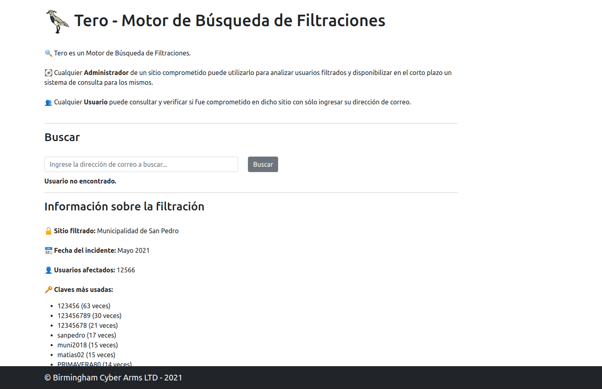
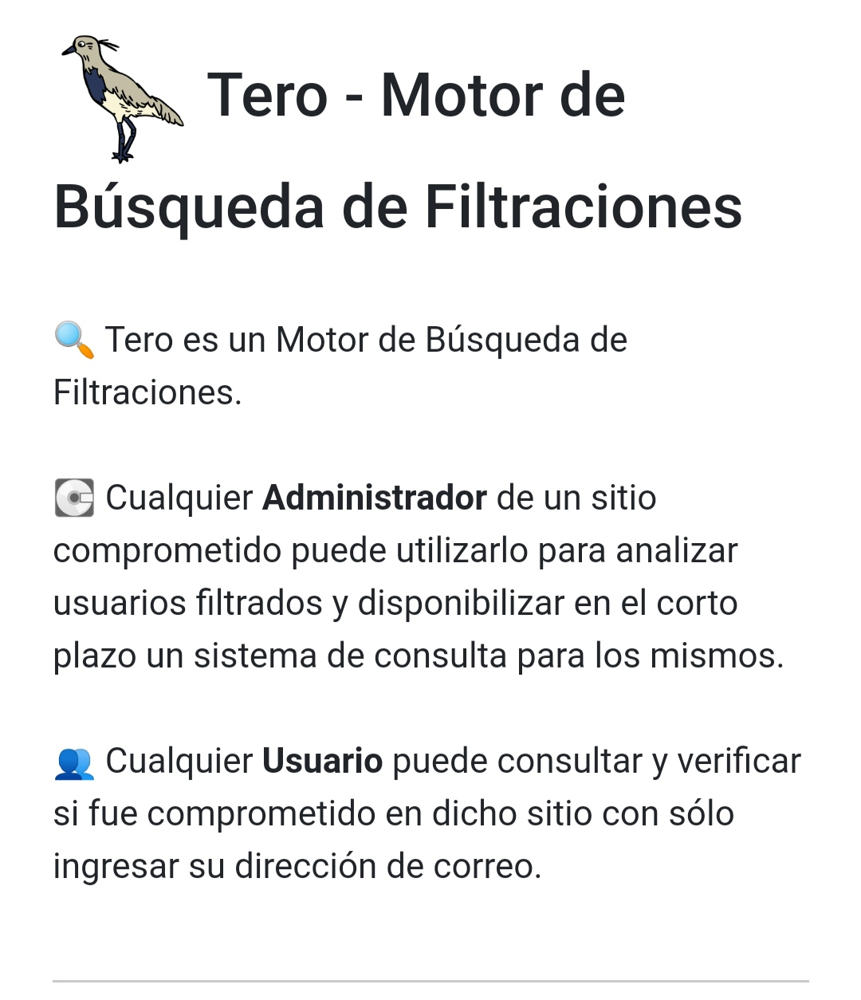
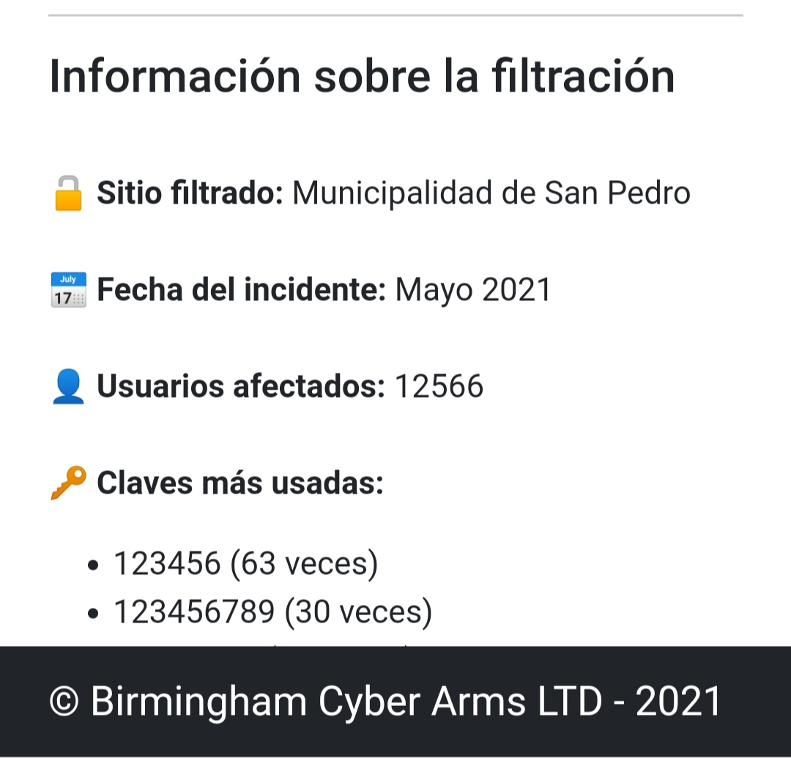
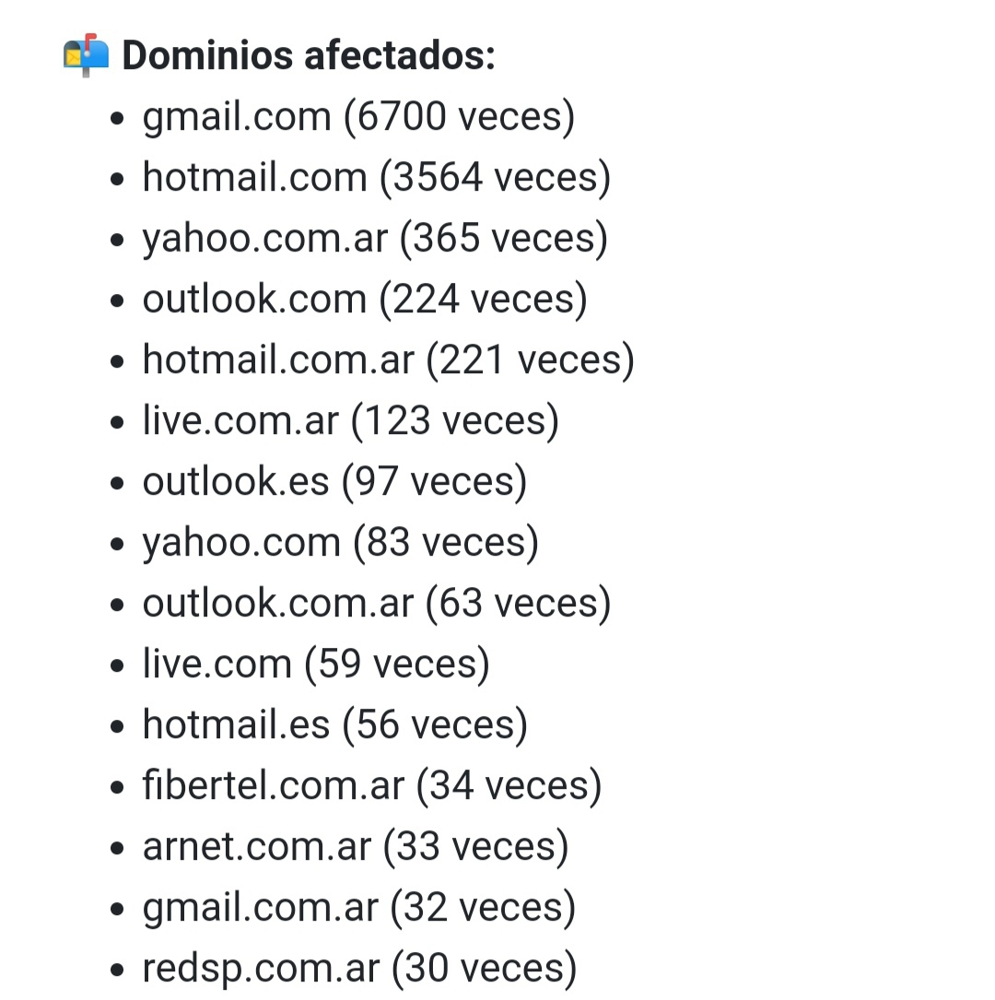

Tero
======

# Acerca de Tero

Tero es una aplicación para analizar filtraciones en sitios. Permite al Administrador de un sitio comprometido utilizarlo para analizar usuarios filtrados y disponibilizar en el corto plazo un sistema de consulta para los mismos; y permite a cualquier Usuario consultar y verificar si fue comprometido en dicho sitio con sólo ingresar su dirección de correo.

Tero fue creado por [Mauro Eldritch](https://github.com/mauroeldritch) y el equipo de [DC5411](https://github.com/dc5411).


## Instalación y Uso

```bash
#En Debian/Ubuntu
sudo apt install ruby-dev build-essential libssl-dev

#Instalar librerías de Ruby
cd build/
sudo bundle
```

Configurar el nombre de la filtración y la fecha del incidente en el archivo `conf/settings.rb`.

Para analizar la filtración, crear el archivo `db/leaks.csv` conteniendo (separado por comas) cada email comprometido con su correspondiente clave, una por línea.

Ejemplo:

```
prueba@gmail.com,12345
pwnd@gmail.com,123456
```

Colocar los certificados SSL necesarios en la carpeta `ssl` bajo los nombres `tero.crt` (certificado) y `tero.pem` (llave privada). Tero puede funcionar con certificados autofirmados, pero no es lo recomendado.

Siguiendo nuestra política de Full-Disclosure, Tero por defecto imprime las 10 claves más usadas y todos los dominios utilizados. Tener en cuenta este detalle antes de publicar.

Tero puede ser utilizado libremente y modificado, siempre y cuando sea con fines no comerciales y se respeten los créditos en el footer.

## Capturas de pantalla

### Desktop



### Mobile





